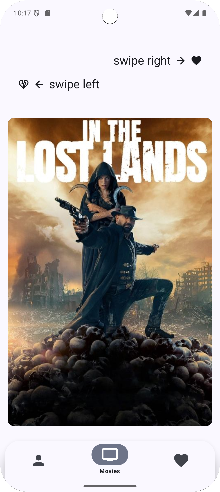
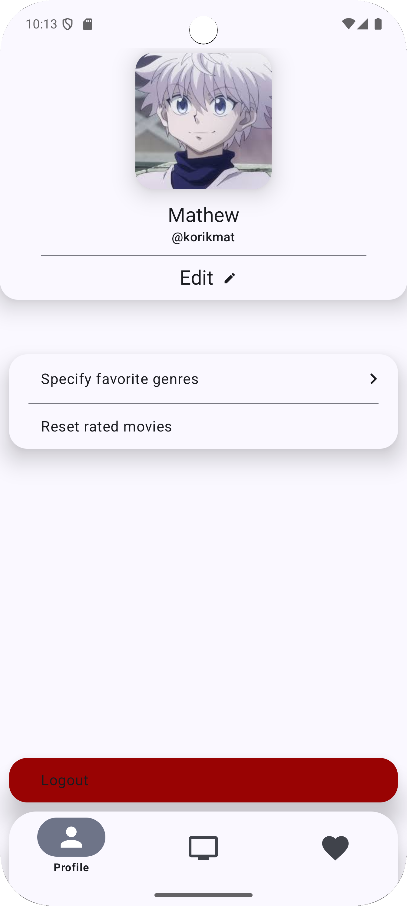
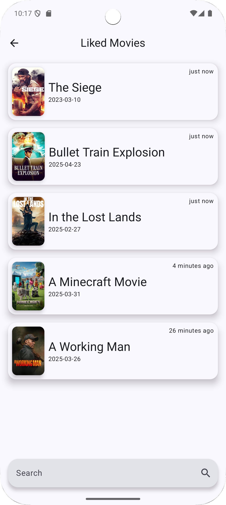
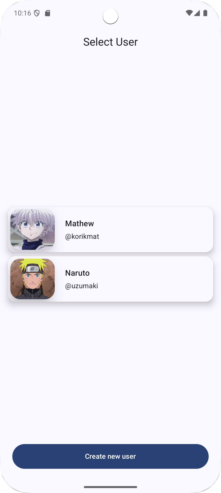

# 📽️ WatchTogether

> **Internet connection is required to use WatchTogether — the app pulls live data from The Movie Database (TMDB).**

Android app that makes it painless to **discover movies together** and build a shared watch‑list. Built entirely with **Jetpack Compose** on top of a modular **Clean Architecture** stack.

---

## ✨ Key Features

| ✨  | Feature                                                                |
|----|------------------------------------------------------------------------|
| 🔍 | Search TMDB catalogue with advanced filters (genre, year, rating)      |
| 🤝 | Create a joint session and like / dislike movies together in real‑time |
| 🚀 | Built for speed: coroutines & Flow                                     |

---

## 🖼️ Demo

| Home                                         | User Profile                                 | Liked Movies                                 | Select User                                |
|----------------------------------------------|----------------------------------------------|----------------------------------------------|--------------------------------------------|
|  |  |  |  |

> Add your gifs or screenshots to `/docs/media` and update the table above.

---


## ⚙️ Tech Stack

| Layer            | Tech                         |
|------------------|------------------------------|
| **Presentation** | Jetpack Compose · Material 3 |
| **Domain**       | Kotlin Coroutines · Flow     |
| **Data**         | Retrofit 2 · OkHttp 5        |
| **DI**           | Koin 3                       |

---

## 📂 Project Structure (Clean Architecture)

```
com.korikmat.watchtogether
 ├─ app             // Compose UI, ViewModels
 ├─ domain          // Use‑cases & models
 └─ data            // Repositories, mappers, DTOs
     ├─ remote      // Retrofit service → TMDB
     └─ local       // Room, DataStore

```

---

### Minimum Requirements

- Android 10.0 (API 29)
- Gradle 8+
- **Internet connection**

---

## 📜 License

Distributed under the MIT License. See `LICENSE` for more information.

---

## 💙 Credits

- Powered by [The Movie Database](https://www.themoviedb.org/) API. TMDB ® is a registered trademark. Data and images are © TMDB.
- JetBrains Kotlin • Jetpack Compose team • Koin & Retrofit maintainers

---

> Made with ❤️ by @korikmat

